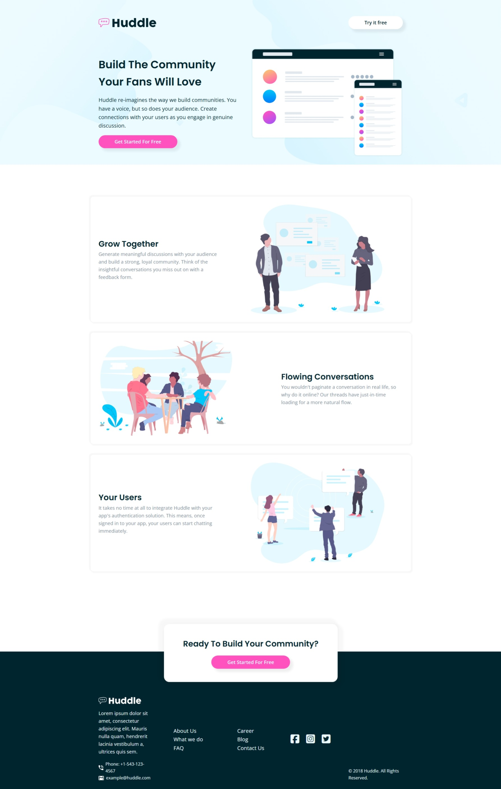

# Frontend Mentor - Huddle landing page with alternating feature blocks solution

This is a solution to the [Huddle landing page with alternating feature blocks challenge on Frontend Mentor](https://www.frontendmentor.io/challenges/huddle-landing-page-with-alternating-feature-blocks-5ca5f5981e82137ec91a5100). Frontend Mentor challenges help you improve your coding skills by building realistic projects.

## Table of contents

- [Overview](#overview)
  - [The challenge](#the-challenge)
  - [Screenshot](#screenshot)
  - [Links](#links)
- [My process](#my-process)
  - [Built with](#built-with)
  - [What I learned](#what-i-learned)
  - [Continued development](#continued-development)
- [Author](#author)

## Overview

### The challenge

Users should be able to:

- View the optimal layout for the site depending on their device's screen size
- See hover states for all interactive elements on the page

### Screenshot

### Links

- Solution URL: [https://github.com/uptowngirl757/huddle-with-alternating-feature-blocks](https://github.com/uptowngirl757/huddle-with-alternating-feature-blocks)
- Live Site URL: [https://uptowngirl757.github.io/huddle-with-alternating-feature-blocks/](https://uptowngirl757.github.io/huddle-with-alternating-feature-blocks/)

## My process

### Built with

- Semantic HTML5 markup
- CSS custom properties
- Flexbox
- CSS Grid

### What I learned

I used the CSS grid for the footer this time instead if flex and learne d a couple of cool stuff along the way

### Continued development

Learn grid better

## Author

- Frontend Mentor - [@uptowngirl757](https://www.frontendmentor.io/profile/uptowngirl757)
